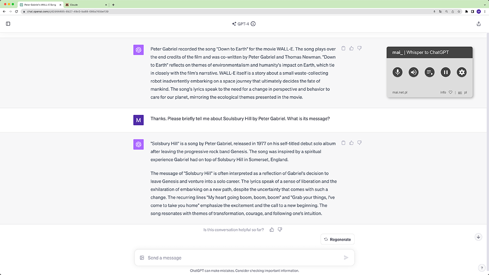
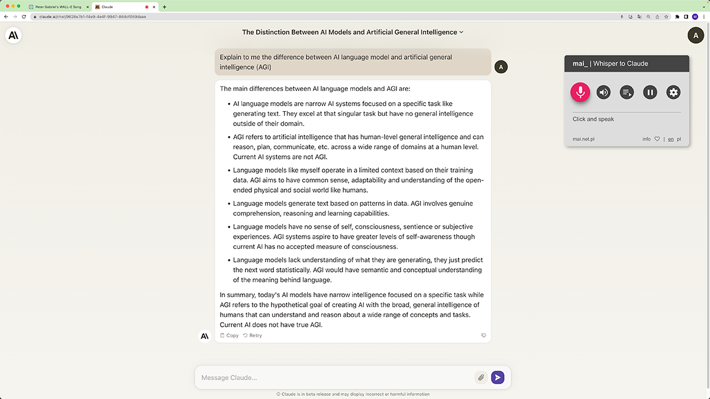
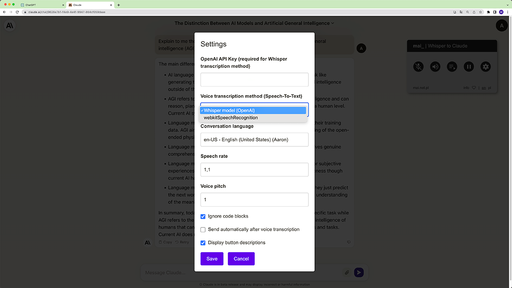

# mai_ | Whisper to ChatGPT and Claude.ai
The extension enables voice interaction with ChatGPT and Claude.ai in Chrome browser and other
Chromium-based browsers (e.g. Edge). It allows the use of the AI model "Whisper" developed by OpenAI for
voice to text transcription. You can also use the transcription method built into the browser
(webkitSpeechRecognition).
The extension appears and operates upon visiting <a href="https://chat.openai.com">chat.openai.com</a>
or <a href="https://claude.ai">claude.ai</a>

- [mai\_ | Whisper to ChatGPT and Claude.ai](#mai_--whisper-to-chatgpt-and-claudeai)
  - [Program features](#program-features)
  - [User Interface](#user-interface)
  - [Video Demos](#video-demos)
    - [Youtube - demo 1 (ChatGPT)](#youtube---demo-1-chatgpt)
  - [Screenshots](#screenshots)
    - [Extension in standby mode (ChatGPT)](#extension-in-standby-mode-chatgpt)
    - [Extension during voice recording (Claude.ai)](#extension-during-voice-recording-claudeai)
    - [Settings](#settings)
  - [Installation](#installation)
    - [Chrome Store](#chrome-store)
    - [Manual Installation](#manual-installation)
  - [STT Voice Transcription (speech-to-text)](#stt-voice-transcription-speech-to-text)
  - [TTS Speech Synthesis (text-to-speech)](#tts-speech-synthesis-text-to-speech)
  - [Privacy and User Data](#privacy-and-user-data)
  - [License](#license)
  - [Inspirations](#inspirations)
  - [Your Support](#your-support)

## Program features
- you can talk to the chat by speaking into the microphone and its responses will be read out loud
- you can enable an option that will read your entire chat conversation out loud,or only read the last response aloud
- you can highlight a text fragment in the chat thread and enable a feature to read this fragment out loud
- in the extension configuration, you can set voice parameters, including the language in which you converse with the chat, voice, voice pitch and reading speed, voice transcription method
  

## User Interface
| Icon | Description |
|------|-------------|
|  | Click and dictate your question using speech-to-text technology. The icon changes color to red during voice recording. Click again to end voice recording and convert speech to text. Choose your preferred transcription method in the extension settings. Details regarding the available methods can be found below. |
|  | Microphone is off - "Speech-To-Text" function is unavailable. |
|  | If this option is enabled, the appearing chat response will be automatically read out loud. You can disable this option by clicking on this button. If the response reading is ongoing (the button is pulsing red), you can interrupt the reading by clicking on this button. |
|  | Automatic reading of responses is disabled. Click if you want to enable the feature again. |
|  | Click once **(single click)** to read aloud the entire thread from the first post. Click quickly twice **(double click)** to read the last post (response) in the thread. If thread reading is ongoing - the button is pulsing red - you can interrupt it at any time by clicking on the button. You can also select any text fragment, click on this icon to read it aloud. |
|  | Click to pause or resume reading the thread (or chat response). |
|  | Click to open and adjust the extension settings. You can configure the settings for voice to text transcription, voice parameters for the TTS (Text-To-Speech) synthesizer, and other preferences. More information about TTS configuration. |

## Video Demos
Check out these video demo to see the extension in action:

### Youtube - demo 1 (ChatGPT)

[https://youtu.be/LN7LakWMjp8?si=nBo6j2vi9eocme6F](https://youtu.be/LN7LakWMjp8?si=nBo6j2vi9eocme6F)

## Screenshots
Below are a few screenshots that showcase the extension's features:

### Extension in standby mode (ChatGPT)

### Extension during voice recording (Claude.ai)

### Settings
This is the settings menu where you can customize various aspects of the extension to suit your preferences.

## Installation

### Chrome Store 
https://chromewebstore.google.com/detail/mai-whisper-to-chatgpt-an/eikfokiiajomccicnkljhdkgeaoicmem

### Manual Installation
If you'd like to install the extension manually before it's available in the Chrome Store, follow these steps:

1. Download the source code from this GitHub repository.
2. Unzip the downloaded file to your preferred location.
3. Open the Chrome browser and navigate to `chrome://extensions/`.
4. Enable "Developer mode" by toggling the switch in the upper-right corner.
5. Click on the "Load unpacked" button that appears.
6. Select the unzipped folder of the extension's source code.
7. The extension should now be installed and visible in your list of extensions.

Note: Since the extension is installed manually, it won't automatically update. To update, you'll need to download the latest version from this repository and repeat the above steps.

## STT Voice Transcription (speech-to-text)
The extension offers two methods of voice transcription:
- **webkitSpeechRecognition** - the default method using Chrome browser's API. Transcription is performed locally (offline). Note: This method does not add punctuation and is supported only in Chrome browser.
- **Whisper** - an AI model developed by OpenAI for speech to text transcription. It offers high-quality transcription with proper punctuation. Requires an OpenAI API key, which involves costs [OpenAI pricing](https://openai.com/pricing). Transcription is performed on OpenAI servers, which requires sending the audio recording.

## TTS Speech Synthesis (text-to-speech)
- The extension utilizes **speechSynthesis** - an API provided by Chrome browser and other Chromium-based browsers (e.g., Edge, Opera, Brave). This allows for speech synthesis (TTS) in offline mode, without data transmission.
- In the settings, you can choose the language and voice used for speech synthesis, as well as adjust other parameters, including voice pitch and reading speed.

## Privacy and User Data
The extension does not collect or transmit any personal data. All settings are stored locally in your browser (localStorage). However, if you decide to use the "Whisper" transcription method and provide your OpenAI API key, the extension will communicate with OpenAI servers, sending audio recordings for transcription, and the OpenAI servers will return the transcription text.

## License
This is an OpenSource project which I am making available under the GNU Affero General Public License v3.0 [https://www.gnu.org/licenses/agpl-3.0.en.html](https://www.gnu.org/licenses/agpl-3.0.en.html) on the GitHub.com platform.

## Inspirations
The inspiration for writing this extension came from the project:
[talk-to-chatgpt](https://github.com/C-Nedelcu/talk-to-chatgpt) by C-Nedelcu.
I am very grateful to him for making it available! However, I needed an extension with slightly different functionality, and I also wanted to add support for OpenAI's Whisper model due to its excellent transcription. As I wrote, I had more and more different ideas, so I wrote this project from scratch and implemented a completely different project architecture, which I hope will allow for easy expansion with additional features and support for other pages and AI chats in the near future.

## Your Support
 This project arose from curiosity, passion, and the joy of programming but at the same time required a significant amount of time and effort. If you like this extension and find it useful, I am very pleased. And if you can support with a donation to the Reborn Foundation, where I teach yoga and spine therapy classes [www.bosajoga.pl](https://www.bosajoga.pl), I would be very grateful.

Your donation will support the statutory activity of our foundation, enabling the continuation of yoga classes and spine therapy sessions. The goal of these sessions is to improve the quality of life of participants by promoting physical and mental health. Your support will help cover the necessary operational costs associated with running our activities, which is crucial for continuing the mission and will allow us to grow.

Thank you very much in advance for your support!

